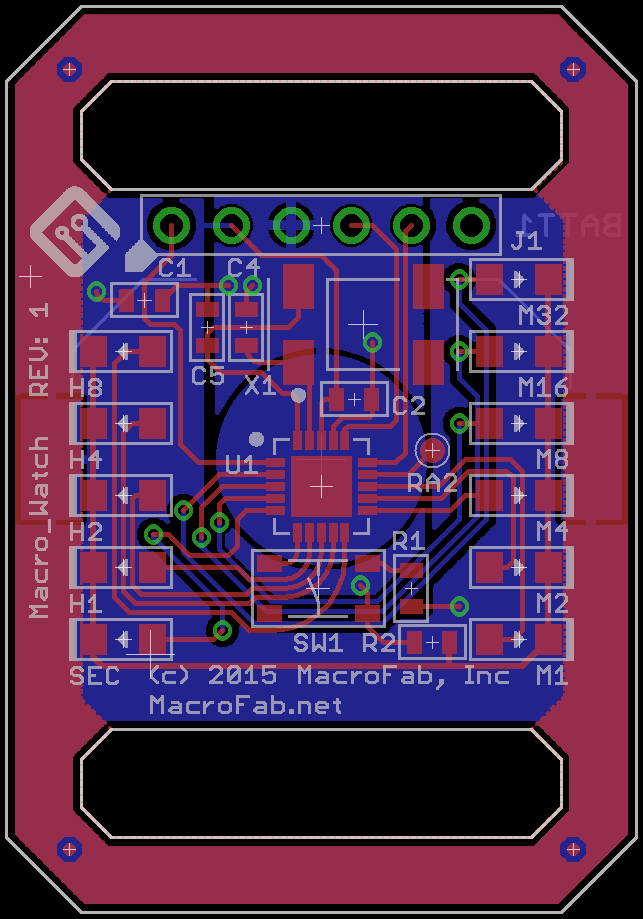
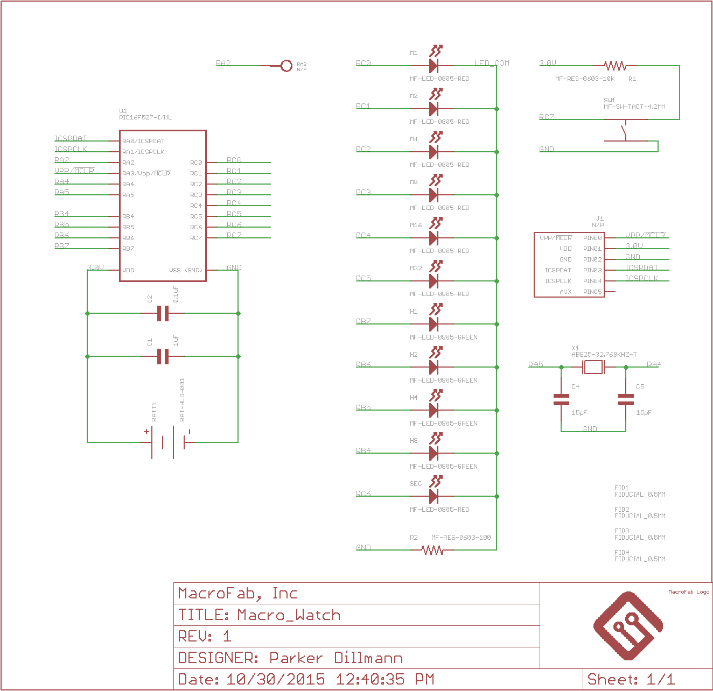
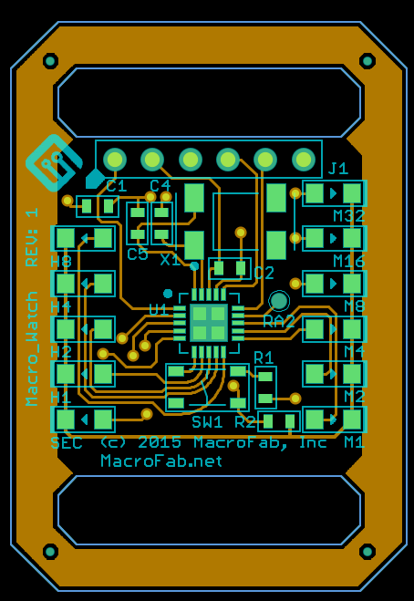

###Macro_Watch Hardware
***
**Low cost, binary watch based off the PIC16F527 MCU for promotional purposes at MacroFab, INC.**

***

***

***

Files are for Eagle V6.0+. Gerber files can be found in the camfiles directory. See main directory for licensing. 
