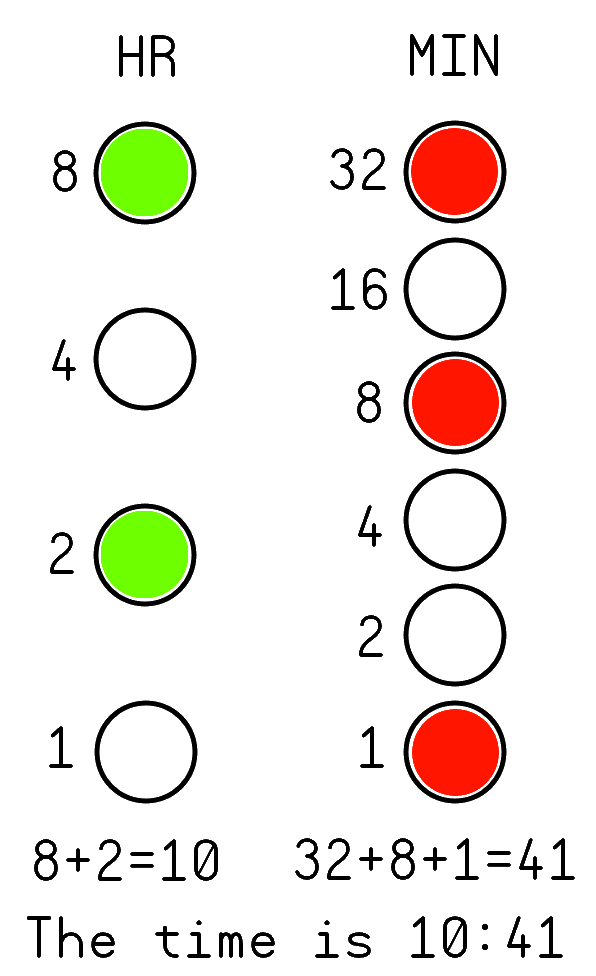

###Macro_Watch
***
**Low cost, binary watch based off the PIC16F527 MCU for promotional purposes at MacroFab, INC.**

This repository contains all the documentation and instructions needed to build a Macro_Watch. The Macro_Watch is a binary style watch based off the [PIC16F527](http://ww1.microchip.com/downloads/en/DeviceDoc/41652A.pdf). It is designed to be low cost and easy to manufacture. The watch runs off of a single CR2032. The PIC16F527 is running in "LP" (Low Power Crystal Mode) which has an average power draw of ~16uA @ the 3.0V the watch runs at. The crystal is a 32.768kHz which allows for a clean conversion to a 1Hz signal for timekeeping. The Macro_Watch is designed to be mounted on an ESD wrist band. 

***
**How to assemble the Macro_Watch Kit**

More info on assembly will come soon.

***
**Instructions on how to use the Macro_Watch**

The Macro_Watch has 11 LEDs. Four LEDs for the Hour (H1 - H4), Six LEDs for the Minute (M1 - M6), and a single Seconds LED for timing purposes. This guide will not go into how to read binary but a good guide can be found [here](http://www.wikihow.com/Read-Binary). 

The LEDs represent the following numbers. The Seconds LED (SEC on the PCB) blinks every second. 

** Table of the LED layout on the Macro_Watch
| LED Identifier | Number | LED Identifier | Number
|---|---|---|---|
| N/A | N/A | M6 | 32 Minutes |
| H4 | 8 Hours | M5 | 16 Minutes |
| H3 | 4 Hours | M4 | 8 Minutes |
| H2 | 2 Hours | M3 | 4 Minutes |
| H1 | 1 Hour | M2 | 2 Minutes |
| SEC | Second Blinker | M1 | 1 Minute |

***
**Theory of operation**

More info about the timing will be added soon.

***
**License Information**

This project is under the [Creative Commons Attribution-ShareAlike 4.0 International License](LICENSE.md). This project is provided with no warranty and should be used at your own risk. 

***

| Directory | Description |
|---|---|
| Hardware | Contains all the hardware files for the Macro_Watch. Designed with Eagle V6.0+. | 
| Software | Has all the firmware that needs to be loaded onto the Macro_Watch. Written in C for MPLAB X IDE V3.10. |

***

