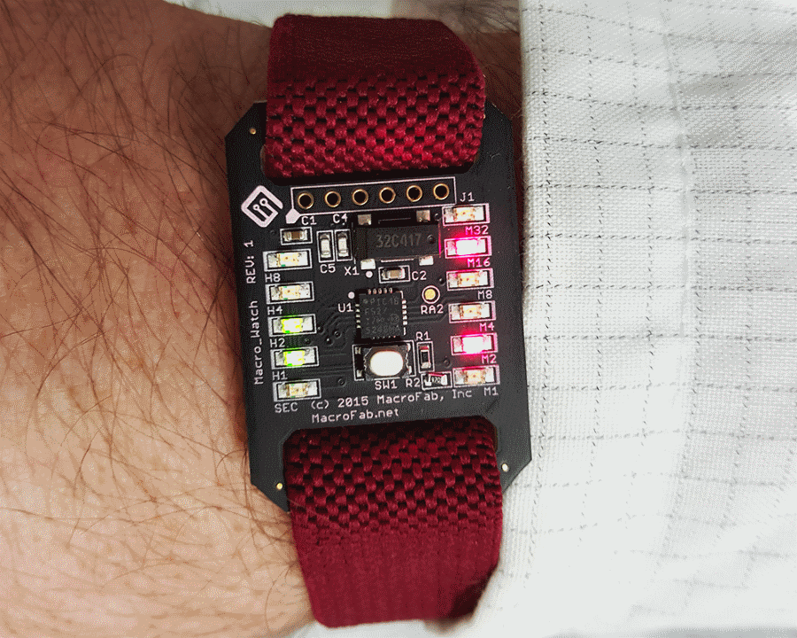
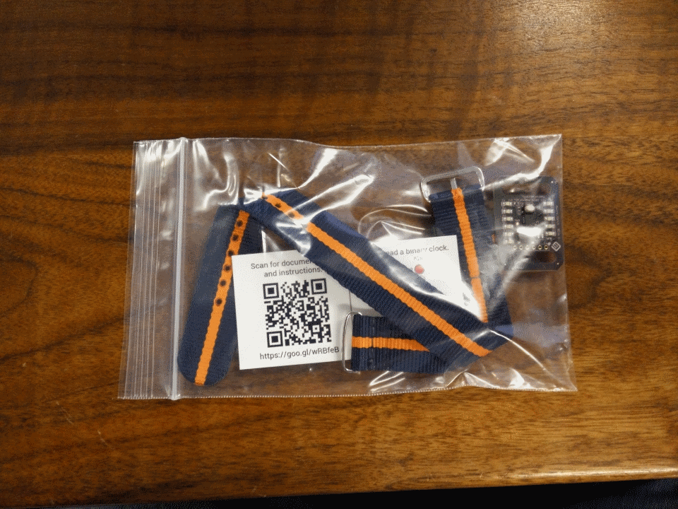
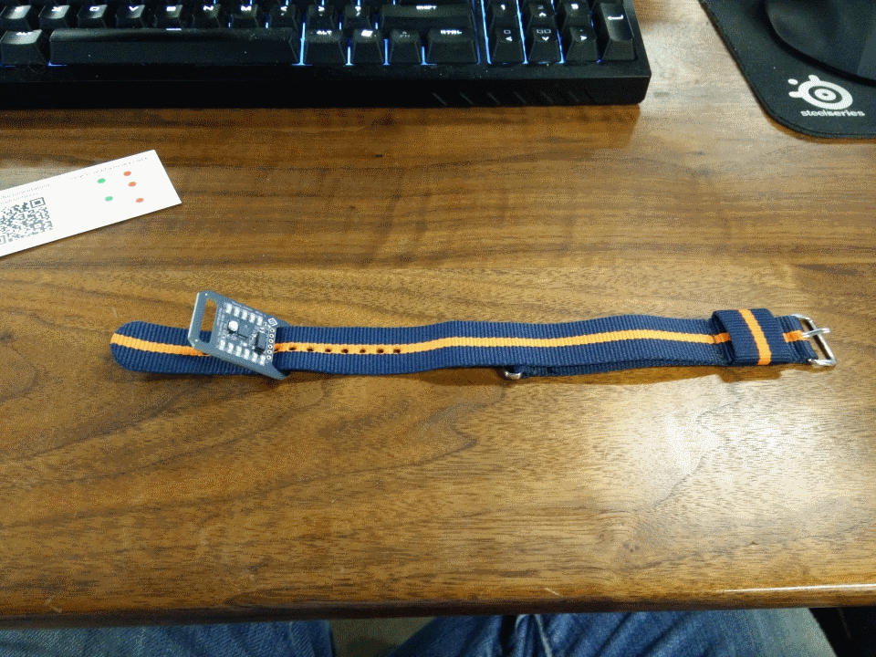
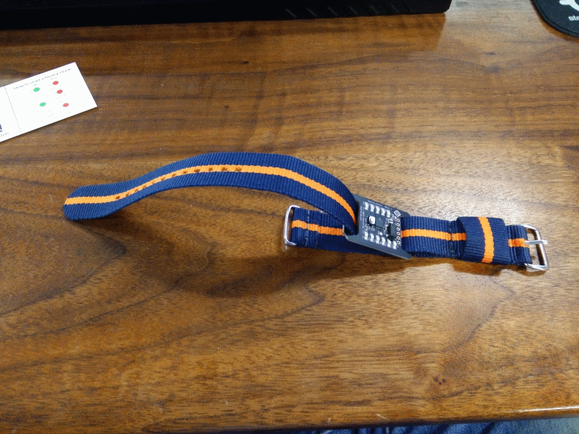
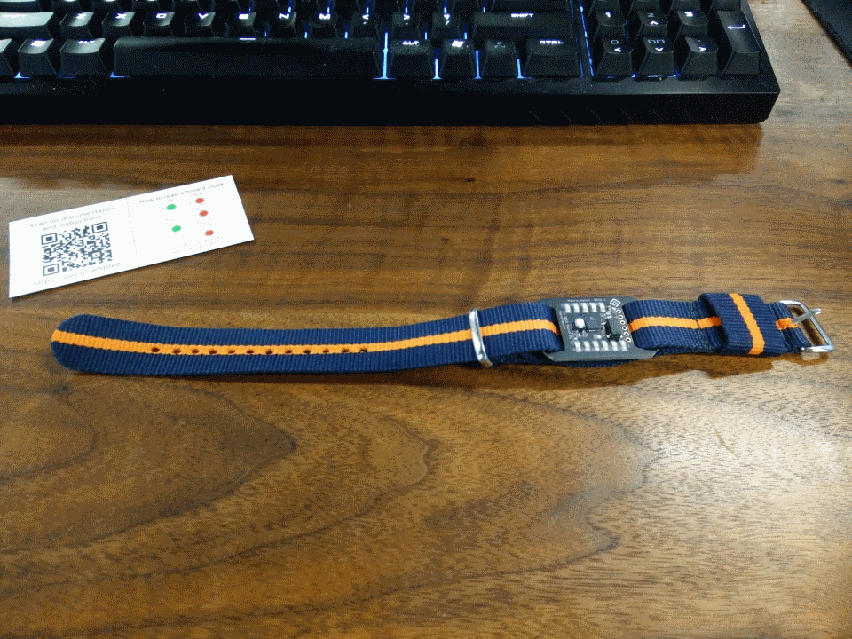
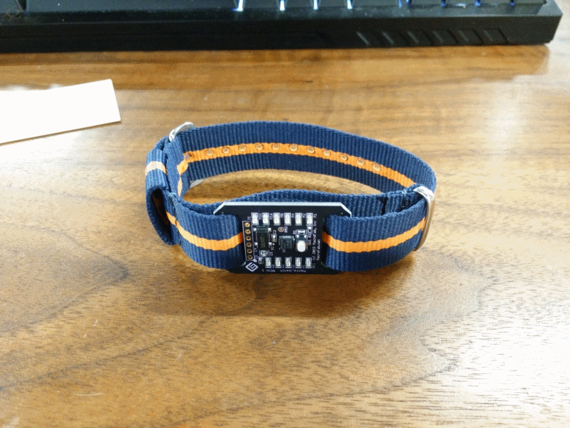
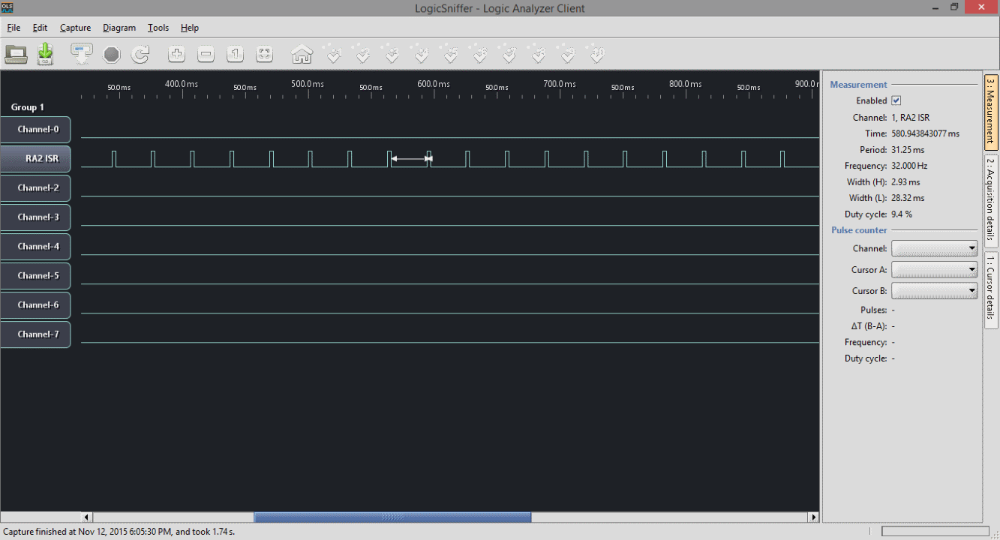
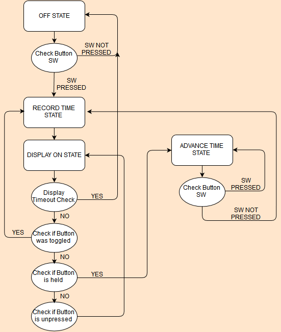

***
###Macro_Watch
***
**Low cost, binary watch based off the PIC16F527 MCU for promotional purposes at MacroFab, INC.**

This repository contains all the documentation and instructions needed to build a Macro_Watch. The Macro_Watch is a binary style watch based off the [PIC16F527](http://ww1.microchip.com/downloads/en/DeviceDoc/41652A.pdf). It is designed to be low cost and easy to manufacture. The watch runs off of a single CR2032. The PIC16F527 is running in "LP" (Low Power Crystal Mode) which has an average power draw of ~15.8uA @ the 3.0V the watch runs at. The crystal is a 32.768kHz which allows for a clean conversion to a 1Hz signal for timekeeping. The Macro_Watch is designed to be mounted on an ESD wrist band. 

***
**How to assemble the Macro_Watch Kit**

To attach the wrist strap to the Macro_Watch follow the pictures below.

***
**Instructions on how to read and use the Macro_Watch**

The Macro_Watch has 11 LEDs. Four LEDs for the Hour (H1 - H4), Six LEDs for the Minute (M1 - M6), and a single Seconds LED for timing purposes. This guide will not go into how to read binary but a good guide can be found [here](http://www.wikihow.com/Read-Binary). Pressing the switch on the front will lit up the LEDs for 10 seconds to allow reading of the time. Holding the switch for 3 seconds will allow setting the current time. The time advances with acceleration so the longer the button is pressed the faster the time will increase. There is no AM/PM indicator on the watch. The SEC LED can be repurposed for AM/PM use or the user can look outside and see if the sun is out. 

The LEDs represent the following numbers. The Seconds LED (SEC on the PCB) blinks every second. 

**Table of the LED layout on the Macro_Watch**

| LED Identifier | Number | LED Identifier | Number
|---|---|---|---|
| N/A | N/A | M6 | 32 Minutes |
| H4 | 8 Hours | M5 | 16 Minutes |
| H3 | 4 Hours | M4 | 8 Minutes |
| H2 | 2 Hours | M3 | 4 Minutes |
| H1 | 1 Hour | M2 | 2 Minutes |
| SEC | Second Blinker | M1 | 1 Minute |

***

The idea is to take the LEDs that are lit up and then add up the numbers they represent. If H3 and H1 LED are lit up that will be 4 + 1 = 5 so it is the 5th hour. 

***
**Theory of operation**

The code works by using Timer0 on the PIC16F527 to time keep. Using a 32.768kHz oscillator and no timer prescaler (by setting the prescaler to work on the WDT instead of Timer0) the Timer0 ISR happens 32 times a second. The ISR counts 32 times and then adds one second to the current time. The pad labeled RA2 on the MacroWatch is high when ISR starts and goes low when the ISR finishes. 

The main loop of the code is a small state machine that keeps track what mode the watch is currently in. The first state is the idle state where the watch poles the switch and awaits the users input. Once the button is pressed it moves to the second state which is to calculate how long the watch will display for and then it moves on to state three. State three does the bulk of the work by branching based on how much time the display has been on for and what the user is currently doing. The watch is also driving the LEDs in this state. If the user has held the button for more then 3 seconds the watch goes into state four. State four advances the time. The longer the button is pressed the faster the time advances. Below is a state machine diagram showing how the code branches.

 

***
**License Information**

This project is under the [Creative Commons Attribution-ShareAlike 4.0 International License](LICENSE.md). This project is provided with no warranty and should be used at your own risk. 

***
**Directory listing of the repository**

| Directory | Description |
|---|---|
| Hardware | Contains all the hardware files for the Macro_Watch. Designed with Eagle V6.0+. | 
| Software | Has all the firmware that needs to be loaded onto the Macro_Watch. Written in C for MPLAB X IDE V3.10. |

***
**Credits**

Designed by:   
Parker Dillmann  

Software by:   
Parker Dillmann  

***

